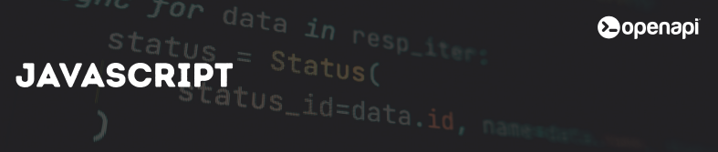

<div align="center">
  <a href="https://openapi.com/">
    
  </a>

  <h1>Openapi® client for Node.js</h1>
  <h4>The perfect starting point to integrate <a href="https://openapi.com/">Openapi®</a> within your Node.js project</h4>

  [](https://github.com/openapi/openapi-nodejs-sdk/actions/workflows/node.js.yml)
  [](https://www.npmjs.com/package/@altravia/openapi)
  [](LICENSE)
  [](https://nodejs.org/)
</div>

## Overview

This client provides an idiomatic Node.js interface to the APIs available at [Openapi](https://openapi.com).
It simplifies integration with the Openapi Marketplace, offering typed requests, promise support, and built-in error handling.
With this SDK you can quickly connect to hundreds of certified APIs and accelerate your digital transformation projects.

## Pre-requisites

Before using the Openapi Node.js Client, you will need an account at [Openapi](https://console.openapi.com/) and an API key to the sandbox and/or production environment

## What you can do

With the Openapi Node.js Client, you can easily interact with a variety of services in the Openapi Marketplace. For example, you can:

- 📩 **Send SMS messages** with delivery reports and custom sender IDs
- 💸 **Process bills and payments** in real time via API
- 🧾 **Send electronic invoices** securely to the Italian Revenue Agency
- 📄 **Generate PDFs** from HTML content, including JavaScript rendering
- ✉️ **Manage certified emails** and legal communications via Italian Legalmail

For a complete list of all available services, check out the [Openapi Marketplace](https://console.openapi.com/) 🌐

## Installation

You can add the Openapi Node.js Client to your project with the following command:

```bash
npm install @altravia/openapi
```

## Usage

The client has two main operational modes:

### 1. Token Generation (OAuth Client)

Use the `OauthClient` to generate access tokens for API access:

```typescript
import { OauthClient } from '@altravia/openapi';

interface TokenResponse {
    token: string;
}

async function main() {
    // Initialize the OAuth client
    const oauthClient = new OauthClient('<your_username>', '<your_apikey>', true);

    // Create a token for a list of scopes
    const scopes = [
        'GET:test.imprese.openapi.it/advance',
        'POST:test.postontarget.com/fields/country',
    ];
    const ttl = 3600;
    const result = await oauthClient.createToken(scopes, ttl);

    // Parse the response
    const response: TokenResponse = JSON.parse(result);
    console.log('Generated token:', response.token);

    // Delete the token when done
    await oauthClient.deleteToken(response.token);
}

main().catch(console.error);
```

### 2. API Calls (Using Access Tokens)

Use the `Client` to make API calls with your access tokens:

```typescript
import { Client } from '@altravia/openapi';

async function main() {
    // Initialize the client with your access token
    const client = new Client('<your_access_token>');

    // Make a GET request with parameters
    const params = {
        denominazione: 'altravia',
        provincia: 'RM',
        codice_ateco: '6201'
    };

    const result = await client.get(
        'https://test.imprese.openapi.it/advance',
        params
    );

    console.log('API Response:', result);

    // Make a POST request with JSON payload
    interface Query {
        country_code: string;
    }

    interface Payload {
        limit: number;
        query: Query;
    }

    const payload: Payload = {
        limit: 10,
        query: {
            country_code: 'IT'
        }
    };

    const postResult = await client.post(
        'https://test.postontarget.com/fields/country',
        payload
    );

    console.log('POST Response:', postResult);
}

main().catch(console.error);
```

### Generic HTTP Methods

The client supports all standard HTTP methods:

```typescript
import { Client } from '@altravia/openapi';

const client = new Client('<your_access_token>');

// GET request
const data = await client.get('https://api.example.com/data');

// POST request
const created = await client.post('https://api.example.com/create', { name: 'test' });

// PUT request
const updated = await client.put('https://api.example.com/update/1', { name: 'updated' });

// DELETE request
await client.delete('https://api.example.com/delete/1');

// PATCH request
const patched = await client.patch('https://api.example.com/patch/1', { status: 'active' });

// Generic request method
const result = await client.request('POST', 'https://api.example.com/custom', { data: 'test' });
```

## Examples

You can find complete examples in the `examples/` directory:

- `examples/token_generation.js` - Token generation example
- `examples/api_calls.js` - API calls example

## Testing

Run tests with:
```bash
npm test
```

## Contributing

Contributions are always welcome! Whether you want to report bugs, suggest new features, improve documentation, or contribute code, your help is appreciated.

Please make sure to follow this project's code of conduct to help maintain a welcoming and collaborative environment.

## Authors

Meet the project authors:

- Openapi Team ([@openapi-it](https://github.com/openapi-it))

## Partners

Meet our partners using Openapi or contributing to this SDK:

- [Blank](https://www.blank.app/)
- [Credit Safe](https://www.creditsafe.com/)
- [Deliveroo](https://deliveroo.it/)
- [Gruppo MOL](https://molgroupitaly.it/it/)
- [Jakala](https://www.jakala.com/)
- [Octotelematics](https://www.octotelematics.com/)
- [OTOQI](https://otoqi.com/)
- [PWC](https://www.pwc.com/)
- [QOMODO S.R.L.](https://www.qomodo.me/)
- [SOUNDREEF S.P.A.](https://www.soundreef.com/)

## License

This project is licensed under the [MIT License](LICENSE).

The MIT License is a permissive open-source license that allows you to freely use, copy, modify, merge, publish, distribute, sublicense, and/or sell copies of the software, provided that the original copyright notice and this permission notice are included in all copies or substantial portions of the software.

In short, you are free to use this SDK in your personal, academic, or commercial projects, with minimal restrictions. The project is provided "as-is", without any warranty of any kind, either expressed or implied, including but not limited to the warranties of merchantability, fitness for a particular purpose, and non-infringement.

For more details, see the full license text at the [MIT License page](https://choosealicense.com/licenses/mit/).
